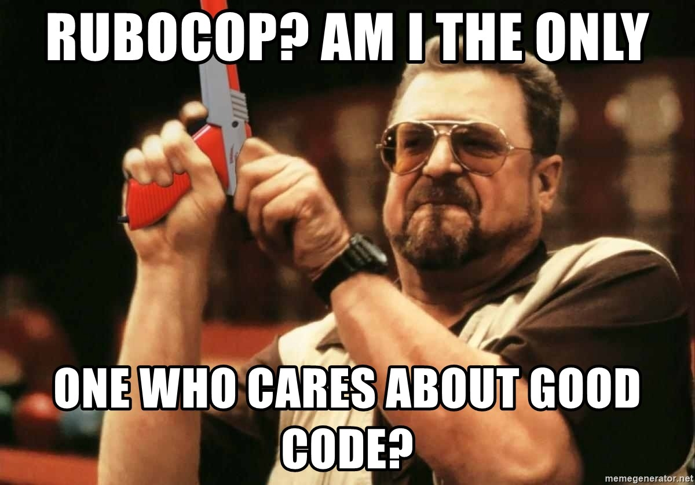

# Danger Pivotal Tracker Plugin

<!-- TOC depthFrom:1 depthTo:6 withLinks:1 updateOnSave:1 orderedList:0 -->

- [Danger Pivotal Tracker Plugin](#danger-pivotal-tracker-plugin)
	- [Installation](#installation)
	- [Usage](#usage)
	- [Development](#development)

<!-- /TOC -->
<body>
  <table>
    <thead>
      <tr>
        <th>Service</th>
        <th>Badge</th>
      </tr>
    </thead>
    <tbody>
      <tr>
        <td>Travis CI (Master)</td>
        <td></td>
      </tr>
      <tr>
        <td>Travis CI (Develop)</td>
        <td></td>
      </tr>
      <tr>
        <td>Code Climate</td>
        <td></td>
      </tr>
      <tr>
        <td>Code Coverage</td>
        <td></td>
      </tr>
      </tbody>
  </table>
</body>

## Installation

    $ gem install danger-pivotal_tracker

## Usage

    Methods and attributes from this plugin are available in
    your `Dangerfile` under the `pivotal_tracker` namespace.

## Development

1.  Clone this repo
2.  Run `bundle install` to setup dependencies.
3.  Run `bundle exec rake spec` to run the tests.
4.  Use `bundle exec guard` to automatically have tests run as you make changes.
5.  Make your changes.

